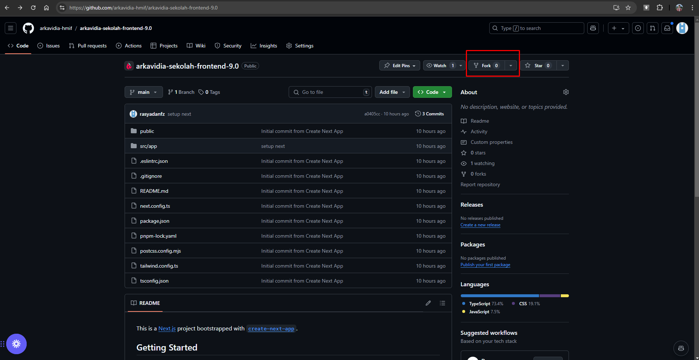

# How to Run

1. Fork repository ini
   

2. Pastikan Node.js sudah terinstall [[Link]](https://nodejs.org/en/download/package-manager)

3. Pastikan pnpm sudah terinstall

```
npm i -g pnpm
```

4. Install library yang dibutuhkan dengan

```
pnpm install
```

5. Jalankan local development dengan

```
pnpm dev
```

6. Website dapat diakses pada localhost:3000
